# sheeprun
羊了个羊的过关工具，娱乐一下

## 环境

- 手机
- 电脑
- 抓包工具Stream

## 演示操作

在手机上安装Stream抓包工具

点击打开工具

Stream安装配置 在appstore搜索Stream，直接下载安装就可以

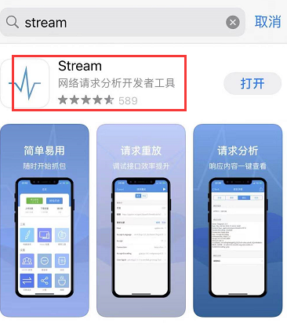

 然后打开软件，可以设置抓取https请求

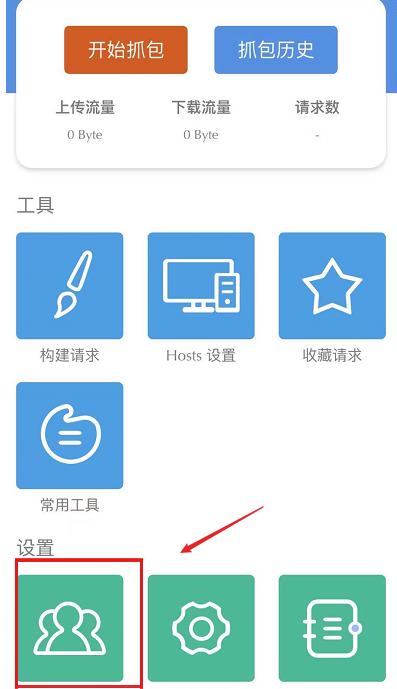

下载安装证书并授权

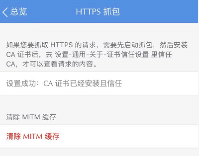

### IOS设置路径：

1.设置—通用—描述文件—信任描述文件

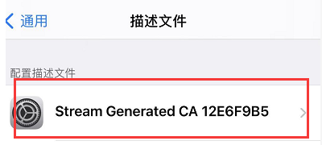

 2.设置—通用—关于本机—证书信任设置

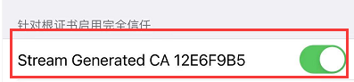

### 安卓用户使用

httpcanary工具

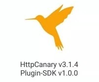

在左边功能当中选择目标应用

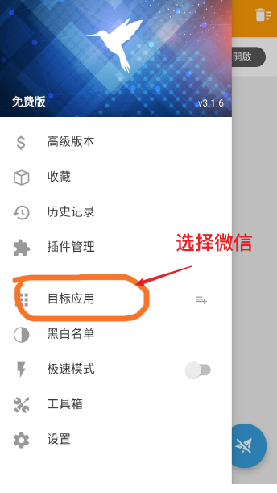

具体看这位师傅的安装指南

[小黄鸟（HTTPCanary）安装及Android高版本CA证书配置*xiao6ming6的博客-CSDN博客*小黄鸟安装ca证书](https://blog.csdn.net/weixin_53891182/article/details/124739048)

### 工具使用

使用stream进行抓包，点击抓包

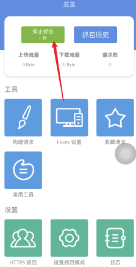

进入微信玩一会羊了个羊

然后回到stream，选择停止抓包，进入抓包历史当中选择最近的包

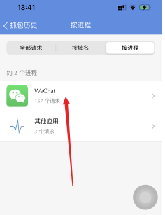

点开微信包，找到有t函数的，进行复制

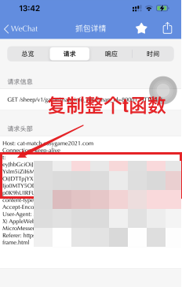

就能获取到token，只用复制t:后面的所有参数

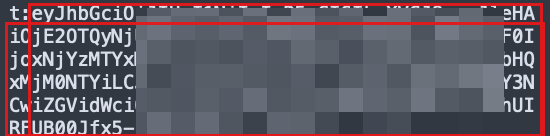

然后打开工具

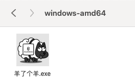

粘贴token 设置成多少次

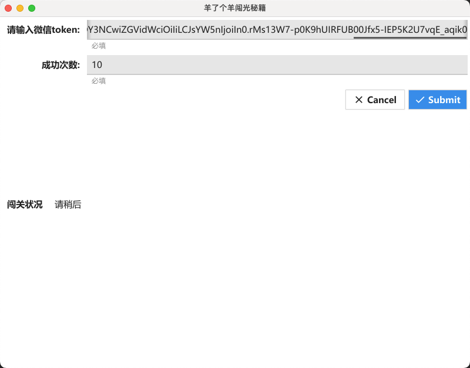

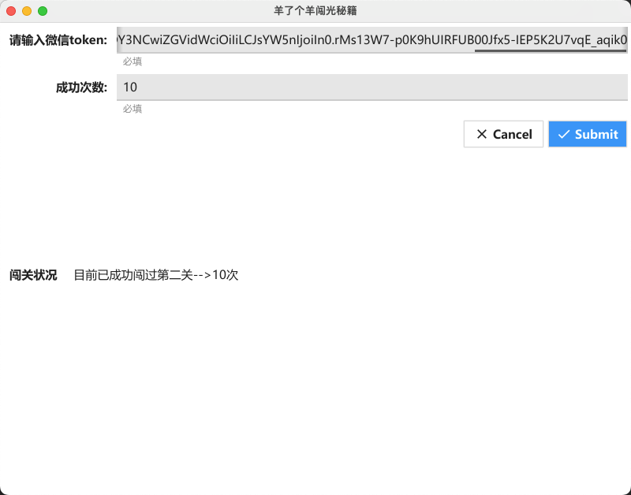

# 悄悄话

如果有用的话，请点个小星星可好？
